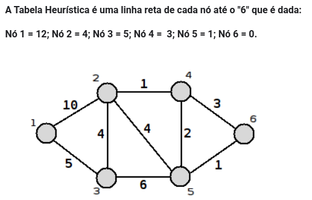
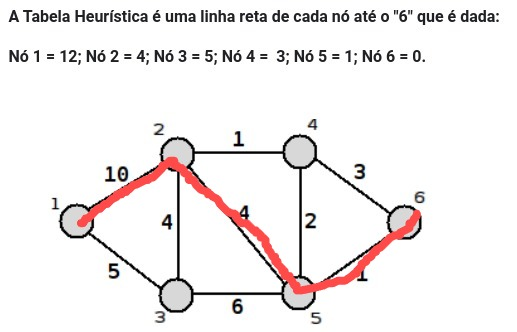

## Overview

This code use KNN methods with database of values for ports nand and xor. There are too functions for apllies search_greeedy 
on whateaver graphs 


Exemple:



Transform this in tuplas(init_not, final_no, weight)

```python
    edges_with_weighet: list[tuple[int, int, int]] = [(0, 1, 10), (0, 2, 5), (1, 4, 4), (1, 2, 4), (1, 3, 1), (2, 4, 6), (4, 5, 1), (3, 4, 2), (3, 5, 3)]

    heuristicas = {0: 12, 1: 4, 2: 5, 3: 3, 4: 1, 5: 1}
    
    path = search_greedy(5, heuristicas, arestas_com_pesos)

    print(path)
    
    # output
    # [[(0, 1, 10)], [(1, 4, 4)], [(4, 5, 1)]]

```





### Instruction

- [ ] Fork this repository

 - [ ] Clone your forked repository

 - [ ] Add your scripts

 - [ ] Commit and push

 - [ ] Celebrate your first project in android development

#### Commit Patterns

The project uses the Conventional Commits standards, so we will use the following commit structure:

```!type(?scope): !subject```

The types can be as follows:

* ```feat``` - Feat type commits indicate that your code snippet is including a new feature (related to the MINOR in semantic versioning).
* ```fix``` - Fix type commits indicate that your committed code snippet is solving a problem (bug fix), (related to the PATCH in semantic versioning).
* ```docs``` - Docs type commits indicate that there have been changes in the documentation, such as in the Readme of your repository. (Does not include code changes).
* ```perf``` - Perf type commits are used to identify any code changes related to performance.
* ```style``` - Style type commits indicate that there have been changes related to code formatting, semicolons, trailing spaces, lint… (Does not include code changes).
* ```refactor``` - Refactor type commits refer to changes due to refactorings that do not alter their functionality, such as a change in the format in which a certain part of the screen is processed, but which maintained the same functionality, or performance improvements due to a code review.
* ```enhancement``` - Enhancement type commits indicate improvements to a feature, that is, something to be added to an existing resource, such as an improvement in the layout of a button.
* ```chore``` - Change outside the runtime environment - Update something without impacting the code (e.g., readme update, CI/CD update…).

The scope refers to the issue id, for example, if there is a ODPR001 issue with a bugfix commit, it should be written following the standard: